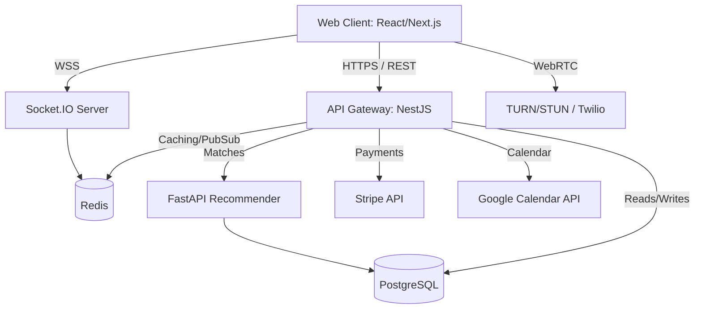
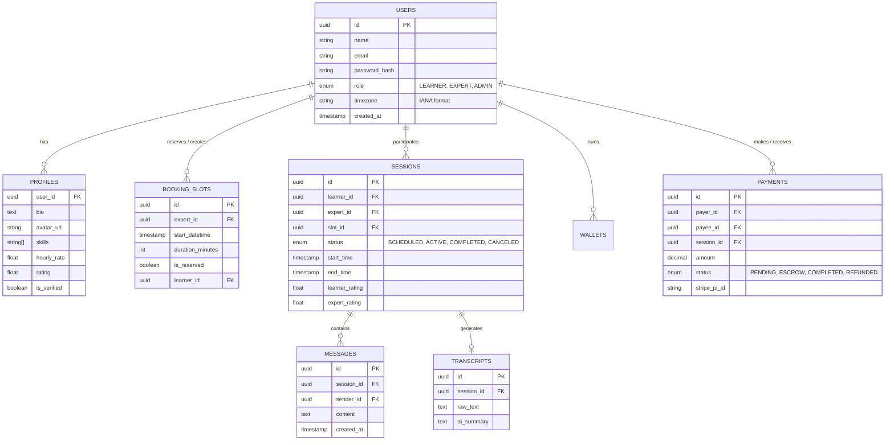

# MANTIS Software Requirements Specification (SRS)

## 1. Introduction
### 1.1 Purpose
This document provides the software requirements specification for MANTIS ("Stop guessing, start talking"), a mentee-expert marketplace. It details the system architecture, features, data models, APIs, and non-functional requirements to build the MVP.

### 1.2 Mission
MANTIS empowers learners (students and novices in tech, design, science, and entrepreneurship) by connecting them with vetted experts (veteran professionals and PhD researchers) who want to teach, build community, and monetize their time. 

### 1.3 Scope
The MVP includes:
- User accounts (Learners, Experts, Admins)
- Expert profile directory with search/filters
- Timezone-aware booking & scheduling
- Live 1-on-1 sessions (WebRTC video + Chat panel)
- Post-session notes, summaries (AI generated), and ratings
- Stripe payments & Escrow system

---

## 2. Personas
1. **The Learner (Alice):** A junior software engineer looking for architecture guidance from a senior engineer. Wants quick booking, clear pricing, and session recordings to review later.
2. **The Expert (Bob):** A Staff Engineer looking to mentor others and earn side income. Wants a seamless calendar integration, secure payouts, and high-quality tooling (video/chat/notes) all in one place.
3. **The Admin (Charlie):** Platform owner who needs to vet expert applications, handle disputes, and monitor system health.

---

## 3. Use Cases
1. **Onboarding:** Learner creates an account. Expert applies, fills bio, sets rate/skills, and is approved.
2. **Search:** Learner searches for "React" or "Python" and filters by hourly rate and rating.
3. **Booking:** Learner views Expert's availability, selects a slot (automatically converted to Learner's local IANA timezone), and pays via Stripe checkout.
4. **Live Session:** Both users join the session room at the scheduled time. They communicate via WebRTC video and Socket.IO chat.
5. **Post-Session:** The system processes the audio/video into a transcript, generates an AI summary, and requests ratings from both parties. Funds are released to the expert's Stripe Connect wallet.

---

## 4. Architecture Diagram

---

## 5. Data Model

### 5.1 ER Diagram

### 5.2 Table Definitions (PostgreSQL)
- **users:** `id` (UUID), `name` (VARCHAR), `role` (ENUM), `email` (VARCHAR), `password_hash` (VARCHAR), `timezone` (VARCHAR - e.g., 'America/New_York').
- **profiles:** `user_id` (UUID, FK), `bio` (TEXT), `avatar` (VARCHAR), `skills` (VARCHAR[]), `rating` (DECIMAL).
- **sessions:** `id` (UUID), `learner_id` (UUID), `expert_id` (UUID), `status` (VARCHAR), `start_time` (TIMESTAMP), `end_time` (TIMESTAMP), `rating` (DECIMAL).
- **bookings_slots:** `id` (UUID), `expert_id` (UUID), `datetime` (TIMESTAMP), `duration` (INT), `is_reserved` (BOOLEAN).
- **messages:** `id` (UUID), `session_id` (UUID), `sender_id` (UUID), `content` (TEXT), `timestamp` (TIMESTAMP).
- **transcripts:** `id` (UUID), `session_id` (UUID), `text` (TEXT), `ai_summary` (TEXT).
- **payments:** `id` (UUID), `payer_id` (UUID), `payee_id` (UUID), `amount` (DECIMAL), `status` (VARCHAR).
- **wallets & coupons:** Supporting tables for payouts and discounts.

---

## 6. Glossary
- **Learner:** A user seeking mentorship.
- **Expert:** A vetted professional offering mentorship.
- **Slot:** A specific block of time made available by an expert.
- **Session:** An active or completed 1-on-1 meeting.
- **Escrow:** Holding the learner's payment safely until the session is completed successfully.
- **IANA Timezone:** Standard timezone identifiers (e.g. `Asia/Kolkata`).
